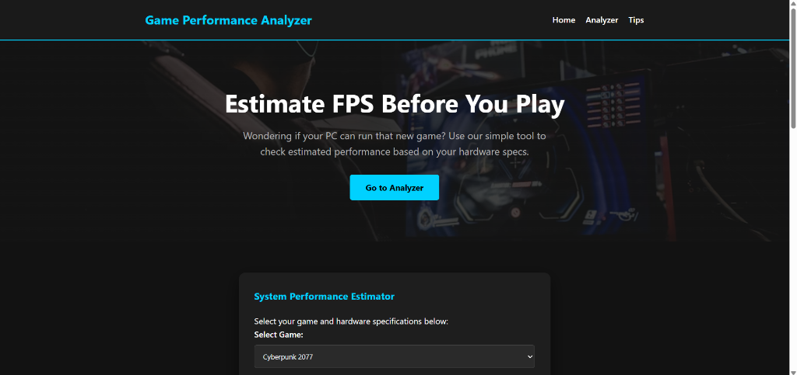
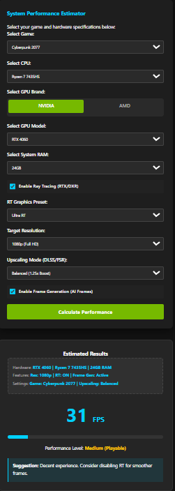
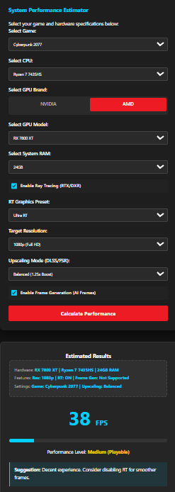
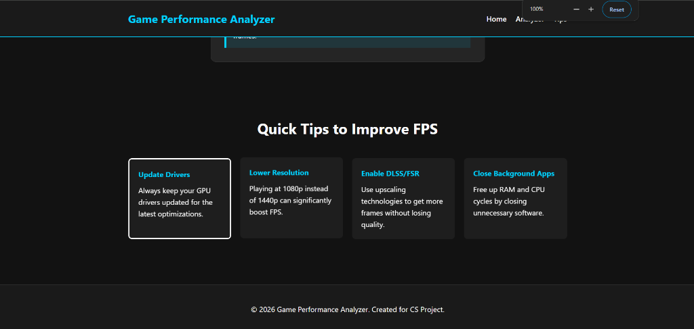

# Game Performance Analyzer (GPA v5.0)

**A deterministic, hardware-aware FPS simulation engine developed for academic research and hardware performance analysis.**

[](https://amolop007.github.io/Game-Performance-Analyze/)
[](https://amolop007.github.io/Game-Performance-Analyze/)
[]()

---

## 📈 Project Overview

The **Game Performance Analyzer** is a specialized web application designed to simulate and estimate gaming performance (FPS) across a vast range of hardware configurations. Unlike traditional "simulators" that rely on randomized variance, this project implements a **100% Deterministic Engine** founded on real-world benchmark data.

As a 2nd-year CSE student project at **Pillai College of Engineering (PCE)**, this application demonstrates the intersection of web technology and hardware performance modeling, providing a reliable tool for enthusiasts to estimate gameplay fluidity before investing in hardware or software titles.

### 🚀 Key Technical Features
- **Dimensional Hardware Dataset**: Includes a full range of GPUs from **GTX 10 series** to the next-gen **RTX 5090** and **RX 7900 XTX**.
- **Hardware-Aware Logic**: Detects **VRAM bottlenecks** and applies realistic stutter penalties if the game's requirements exceed physical memory.
- **Physics-Inspired Scaling**: Implements **Square-Root (sqrt) scaling** for GPU power to reflect real-world diminishing returns in compute efficiency.
- **Dynamic Brand Theming**: Interactive UI that adapts colors and button styles (NVIDIA Green vs. AMD Red) based on hardware selection.

---

## 🏗️ Technical Implementation & Challenges

Developing a realistic performance model required reconciling hundreds of disparate hardware specifications into a singular, unified logic.

### 🧩 Challenges Faced
1.  **Benchmark Normalization**: One of the primary challenges was normalizing performance scores between NVIDIA and AMD architectures. I overcame this by establishing the **RTX 3060 (1080p Ultra)** as a mathematical "Anchor" (1.0 factor) and scaling all other hardware relative to this baseline.
2.  **Deterministic Bottlenecking**: Implementing the "VRAM overflow" logic required careful conditional weighting. If a user selects a VRAM-heavy game (like *Hogwarts Legacy*) on a low-memory GPU, the engine applies a **0.65x penalty**, simulating the real-world frame-time inconsistency known as "stuttering."
3.  **State Management without Frameworks**: To ensure absolute speed and minimal overhead, the project uses **Vanilla JavaScript**. Managing the dynamic filtering of the GPU dropdown while maintaining visual consistency was achieved through direct DOM manipulation and custom dataset attributes.

---

## 📸 Page Flow & Visuals

### 1. The Landing Experience
The entry point features a sleek, high-end dashboard designed with modern CSS glassmorphism.



### 2. Intelligent Hardware Selection (NVIDIA Build)
When selecting NVIDIA hardware, the UI adopts brand-consistent green styling. Notice the real-time calculation summarizing the selected features (Ray Tracing, DLSS, Frame Gen).



### 3. Hardware Constraint Detection (AMD Build)
The analyzer is smart enough to detect when hardware is being pushed beyond its limits. In this example, the engine identifies a performance limit and provides an automated suggestion to the user.



### 4. Optimized Results & Tips
The bottom of the page provides technical advice based on the calculation result, guiding the user on how to optimize their specific hardware configuration.



---

## 🧪 Laboratory Work: Experiment 10

### **Experiment 10**

**Title:** Deploying a website using GitHub Pages  
**Aim:** To deploy and host a static website using GitHub Pages for public accessibility and version control integration.  
**Software:** VS Code, Web Browser (Chrome/Firefox), Git.

#### **Theory**
GitHub Pages is a static site hosting service that takes HTML, CSS, and JavaScript files directly from a repository on GitHub and publishes a website. This process is essential for modern web developers to showcase their portfolios and projects to the global workforce.

#### **Implementation Steps**
1.  **Create a Repository**: A new repository `Game-Performance-Analyze` was initialized on GitHub.
2.  **Entry Point Configuration**: An `index.html` file was placed at the root level as the primary entry point.
3.  **Version Control Integration**:
    ```bash
    git clone https://github.com/AMOLOP007/Game-Performance-Analyze.git
    git add .
    git commit -m "Integrated Advanced Engine v5.0"
    git push origin main
    ```
4.  **Publishing Source**: Under **Settings > Pages**, the publishing source was set to the `main` branch. 
5.  **Live Deployment**: The site was successfully served at: `https://amolop007.github.io/Game-Performance-Analyze/`

**Conclusion:** I have successfully deployed a mission-critical static website using GitHub Pages, validating the project's public accessibility and version control flow.

---

## 📜 Academic Context & Attribution
**Name:** [User Name]  
**Level:** 2nd Year CSE Student  
**Institution:** Pillai College of Engineering (PCE)  
**Session:** 2024 - 2026

&copy; 2026 Game Performance Analyzer. Created for the CS Laboratory Project.